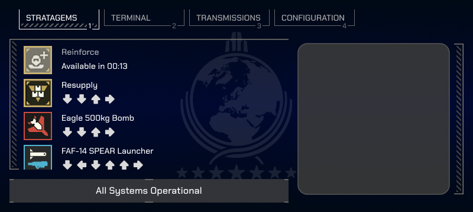
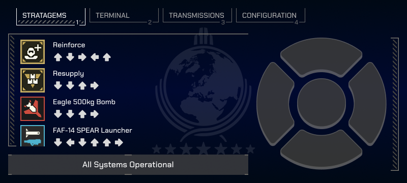
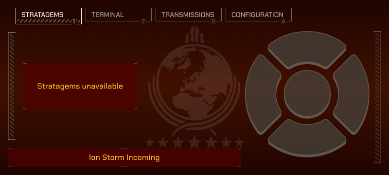
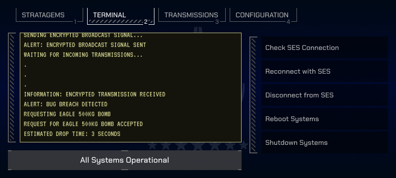
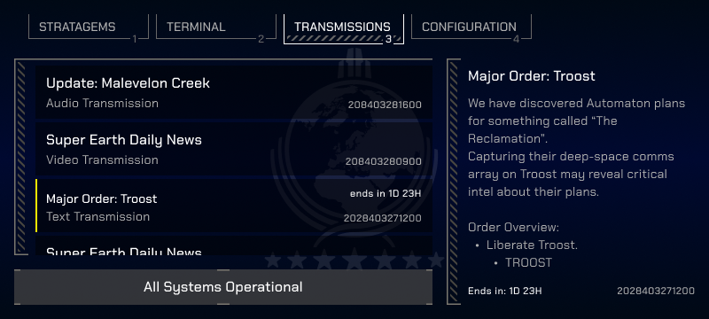
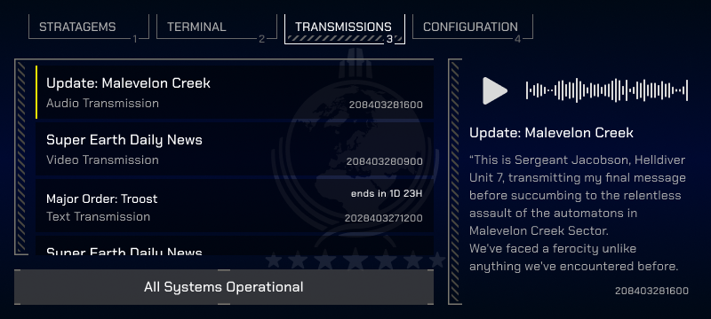

# Helldivers 2 - Tactical User Interface

This project is a tactical user interface for the game Helldivers 2, targeting currently mobile platforms (Android and
iOS). The project is written in Kotlin and uses Compose Multiplatform for the UI.

This project started as a side-project and is currently a draft. It implements the initial designs (see below) and
contains no logic yet.

It is an unofficial project for the game Helldivers 2 created by a fellow helldiver and aiming for a more immersive
gaming experience.

## Status of the Project

Currently, the project implements the basic UI with dummy data and very limited interaction options.

The below list is a break-down of the current tasks:

| Feature          | Status                    |
|------------------|---------------------------|
| Android App      | WIP                       |
| iOS App          | WIP                       |
| API Simulation   | planned                   |
| Game Integration | unknown (see limitations) |

## Project Structure

* `/composeApp` is for code that is shared across the Compose Multiplatform applications.

* `/iosApp` is the entry point for the iOS app.

* `/server` is for the Ktor server application that may simulate or represent the interface to the game.

* `/shared` is for the code that is shared between all targets in the project.

## Limitations

During the proof-of-concept the attempt to simulate inputs in the game with Java's Robot and with native C++ code
failed.
The cause is probebly of the Anti-Cheat system nProtect that is used in the game.

Support for solving this limitation is needed.

## Contribution

Thank you for considering contributing to this project! We welcome contributions from everyone, regardless of whether
you're a software developer or not.

### How to Contribute

For Developers:

1. Fork the repository and clone it to your local machine.
2. Create a new branch for your feature or bug fix: `git checkout -b feature/your-feature` or
   `git checkout -b bugfix/your-bug-fix`
3. Make your changes and ensure they follow our coding guidelines, if applicable.
4. Test your changes thoroughly.
5. Commit your changes: `git commit -am 'Add some feature'` or `git commit -am 'Fix some bug'`
6. Push to the branch: `git push origin feature/your-feature` or `git push origin bugfix/your-bug-fix`
7. Submit a pull request detailing the changes you've made.

For Non-Developers:

1. **Testing and Feedback**: Download and test the application, providing feedback on its usability and any issues
   encountered. You can submit feedback
   by [opening an issue](https://github.com/malliaridis/tactical-interface/issues/new) on GitHub.
2. **Sharing the Project**: Share this project with friends and other helldivers.
3. **Discussing Ideas**: Share your ideas of new features or propose changes you would like to see. You can open a new
   start a new Discussion on GitHub or participate in existing ones.

### What Can I Contribute?

You can contribute in various ways, including but not limited to:

- Adding new features or functionalities.
- Fixing bugs or improving existing code.
- Enhancing documentation.
- Providing usability feedback.
- Requesting new features

## Resources

This project was created with [Kotlin Multiplatform Wizard](https://kmp.jetbrains.com/).

Learn more about [Kotlin Multiplatform](https://www.jetbrains.com/help/kotlin-multiplatform-dev/get-started.html).
and [Compose Multiplatform](https://www.jetbrains.com/lp/compose-multiplatform/).

Some assets from [Helldivers Wiki (Fandom)](https://helldivers.fandom.com/wiki/Helldivers_Wiki) are used.

## License

By contributing to this project, you agree that your contributions will be licensed under the
project's [LICENSE](./LICENSE).
